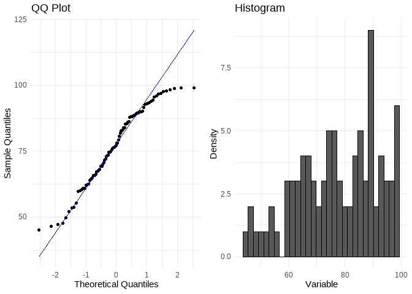

README for Statisfy
================

<!-- README.md is generated from README.Rmd. Please edit that file -->

# Statisfy

<!-- badges: start -->
<!-- badges: end -->

<figure>

<figcaption aria-hidden="true">Statisfy Hex Sticker</figcaption>
</figure>

The **Statisfy** package is a statistician’s best friend. After using
this package, hardworking statisticians can’t help but be left with a
big smile on their face (just look at our hex sticker). Statisfy is
designed to streamline common statistical tasks with user-friendly
functions that identify outliers, output summary statistics, check if
data follows a normal distribution, and even suggest statistical tests
that are appropriate for the user’s needs.

## Installation

You can install the development version of Statisfy like so:

``` r
install.packages("devtools")
devtools::install_github("darianagonza/Statisfy")
```

## Example Dataset

Statisfy comes with a built-in dataset, `thesis_data`, which is a subset
of a larger dataset containing ecological data from Odzala-Kokoua
National Park in the Republic of Congo. This data was collected and
provided by Dariana Gonzalez, who is using the data for her senior
thesis.

Here’s a quick look at the data:

``` r
library(Statisfy)
head(thesis_data)
#> # A tibble: 6 × 11
#>   plot_id       transect_id bai_id ecosystem
#>   <chr>               <dbl> <chr>  <chr>    
#> 1 ambe_f315_15          315 ambe   eco      
#> 2 ambe_f315_315         315 ambe   for      
#> 3 ambe_f225_15          225 ambe   eco      
#> 4 ambe_f225_315         225 ambe   for      
#> 5 ambe_f45_155           45 ambe   for      
#> 6 ambe_f45_15            45 ambe   eco      
#> # ℹ 7 more variables: audiomoth <chr>,
#> #   ph_water <dbl>, temp_water <dbl>,
#> #   temp_air <dbl>, rel_humidity <dbl>,
#> #   total_spp <dbl>, dist_score <dbl>
```

## Package features

### 1. Check for normality using `checkNormality()`

Determine whether a numeric variable in a dataset follows a normal
distribution by inputting the dataframe, the variable, and a line color
into `checkNormality()`. The function will output a histogram of the
variable, a QQ plot, and the results of a Shapiro-Wilk test, providing a
definitive answer for whether the variable indeed follows a normal
distribution. This function can be a prerequisite for the function
`whichTest()`, which is described later on.

Let’s take a look two quick examples:

``` r
# Not normally distributed (choose a nonparametric statistical test)
checkNormality(data = thesis_data, rel_humidity, line_color = "blue")
#> Shapiro-Wilk Test: p-value =0.0051
#> `stat_bin()` using `bins = 30`. Pick better
#> value with `binwidth`.
```



``` r

# `ecosystem` is not a numeric variable, so the function will return an error
# The .Rmd will not render if the function is actually run, but this is how this 
# example would look:
# checkNormality(data = thesis_data, ecosystem, line_color = "red")
```

### 2. Choose the right form of statistical analysis using `whichTest()`

With dozens of statistical tests available, it is often difficult to
know which one is most appropriate for which occasion. `whichTest()`
addresses this issue by taking in up to two variables and, based on the
class of the data and the number and levels of the variables, outputs a
parametric and non-parametric statistical test that can be used to
analyze those variables.

``` r
# One numeric variable and one categorical variable (with 3 levels) 
whichTest(data = thesis_data, var1 = "temp_air", var2 = "ecosystem")
#> [1] "Use a One-Way ANOVA to determine whether there are significant differences between 3+ groups (normal distribution). Use a Kruskal-Wallis Test if data is not normally distributed."

# Two numeric variables
whichTest(data = thesis_data, var1 = "temp_air", var2 = "rel_humidity")
#> [1] "Test for correlation between both variables using a Pearson Correlation Test (normal distribution) or Spearman Correlation Test (not normal distribution). To test how one variable predicts the outcome of another variable, try a Linear Regression."

# One categorical variable
whichTest(data = thesis_data, var1 = "ecosystem")
#> [1] "Visualize patterns in your data using a bar chart or pie chart."
```

### 3. Use `outliers()` to detect outliers

`outliers()` allows the user to identify which points within a numeric
variable deviate significantly from the mean and set the percentile
thresholds that will be used to identify those outliers. By default,
this function uses the 1st and 99th percentiles.

``` r
outliers(thesis_data$temp_air, upper = 0.92, lower = 0.08)
#> $Lower_Bound
#>     8% 
#> 75.936 
#> 
#> $Upper_Bound
#>    92% 
#> 90.388 
#> 
#> $Outliers
#>  [1] 73.9 74.8 91.0 90.4 92.7 74.3 75.9 75.6
#>  [9] 90.6 91.7 90.5 92.0 92.4 74.4 74.7 75.1
```

### 4. Calculate key statistics using `stats()`

In order to choose between more advanced forms of statistical analysis,
sometimes users must have more detailed summary statistics of their
data, including information about dispersion. `stats()` helps the user
obtain more detailed statistics on a numeric variable that summary()
cannot provide, and it does so in the form of a nice APA-style table
(ready for publication!).

``` r
stats(thesis_data$rel_humidity)
```

|  | Mean | Variance | StDev | Min | Max | X25th.Percentile | Median | X75th.Percentile | Coefficient_of_Variation |
|:---|---:|---:|---:|---:|---:|---:|---:|---:|---:|
| 25% | 77.30556 | 211.0035 | 14.52596 | 45.2 | 99.1 | 66.525 | 77.7 | 89.4 | 0.1879032 |

### Authors

This package was designed by Dariana Gonzalez and Yahir Santillan for a
STAT 108 final project. **Statisfy**: A Statistician’s Best Friend!
